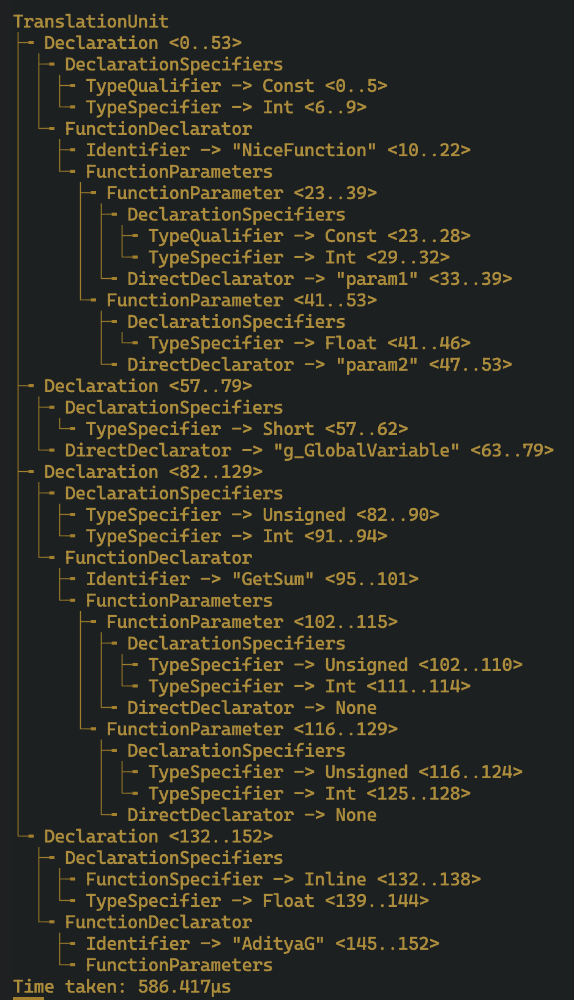

# Flameberry C Compiler (Written in Rust)
Flameberry C compiler is primitive C (ISO 17 standard compliant) compiler which is in early stages and the future plan is to make it a fully featured compiler with decent performance.

**Currently it supports:**
1. Preprocessing comments
2. Lexing every kind of C token
3. Parsing of External Variable and Function Declarations
4. Generation of basic Abstract Syntax Tree for the C Translation Unit

## Demo
For the following Sandbox/test.c program, the generated AST is:
```C
const int NiceFunction(const int param1, float param2);
short g_GlobalVariable;
unsigned int GetSum(unsigned int, unsigned int);
inline float AdityaG();
```



## Getting Started

To build the rust project:

```sh
cargo build
```

Before running the main.rs, don't forget to set the path where your C programs are located (_This will be abstracted in the future and a script will be provided to do the same instead of needing to modify the rust program itself_):

```rust
fn main() {
    let testpath = "<path/to/parent/directory/containing/c/programs>";
    run_tests(testpath);
}
```

Or if you want to test using a single file:

```rust
fn main() {
    let test_path = "Sandbox/test.c";
    compile_file(test_path);
}
```

To run the project:

```sh
cargo run
```

_Note: The repository currently uses test programs present in the repository https://github.com/nlsandler/writing-a-c-compiler-tests to check the output._